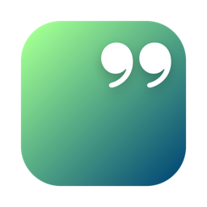
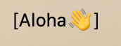
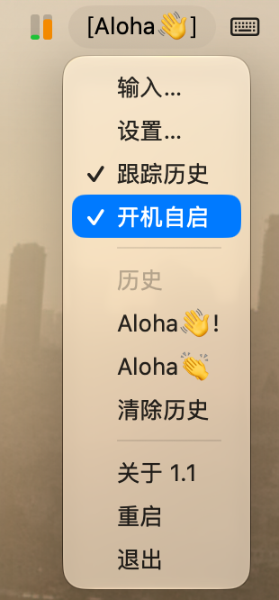
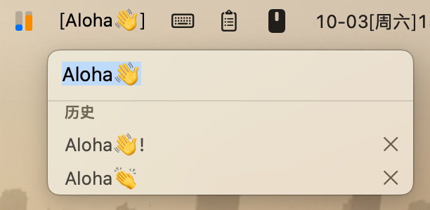
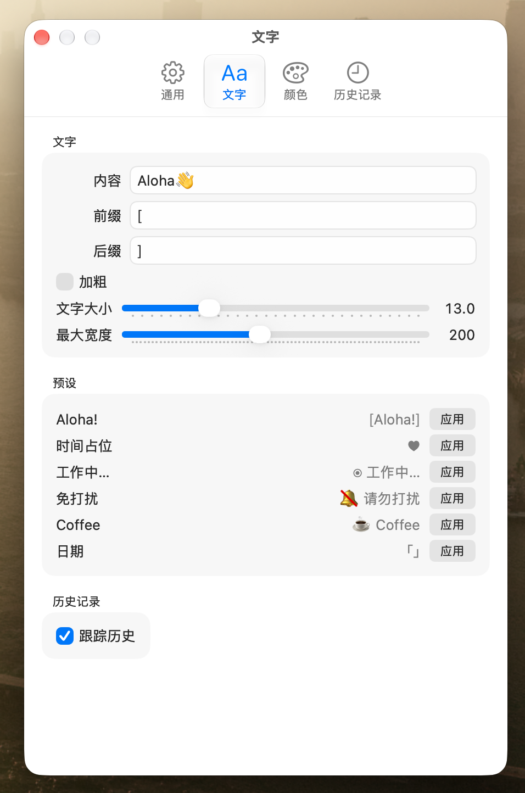

<p align="center">
  
</p>

<h1 align="center">SwiftQuote</h1>

<p align="center">
  
  
  
  
</p>

<p align="center"><a href="README.zh-CN.md">中文</a></p>

<p align="center">A lightweight macOS menu bar app that displays custom text in the menu bar — slogans, reminders, or anything you like.</p>

## Screenshots

<p align="center">
  
</p>

<p align="center">
  
  &nbsp;&nbsp;
  
</p>

<p align="center">
  
</p>

## Features

- **Custom text in the menu bar** — left-click for the menu, right-click to edit instantly
- **Rich styling** — prefix/suffix, font size, bold, per-character colors (multiple colors cycle through characters), max width limit
- **Adaptive colors** — maintain separate palettes for light/dark menu bars; colors switch automatically as the menu bar appearance changes (with a reset-to-default button)
- **Text presets** — one-click templates like "Aloha!", "Do not disturb", "Coffee"
- **History** — keeps the last 10 entries, quick-apply from the menu or settings; the current text is kept out of the list and each entry can be deleted individually
- **Appearance** — System / Light / Dark mode
- **Localization** — System / 中文 / English UI
- **Launch at login** — built with SMAppService (requires running as a bundled app)
- **Lightweight** — ~13 MB baseline memory; windows release their view trees on close, and a built-in **Restart** menu item reclaims memory from long sessions

## Requirements

- macOS 15+
- Swift 6.0+ / Xcode 16+ (for building)

## Build & Run

With SwiftPM:

```sh
swift build
.build/debug/SwiftQuote
```

Or open `SwiftQuote.xcodeproj` in Xcode and run (the project is generated from `project.yml` via [XcodeGen](https://github.com/yonaskolb/XcodeGen): `xcodegen generate`).

## Usage

- **Right-click** the menu bar text to edit it in place (`⏎` to apply, `Esc` to cancel); recent history is shown below the field — click an entry to apply it, or use the × button to delete it
- **Left-click** for the menu: Input…, Settings…, track history toggle, launch-at-login toggle, recent history (up to 5), About (with version), Restart, Quit
- Settings has four tabs: **General** (theme, language & startup), **Text** (content, prefix/suffix, font, presets), **Colors** (per-character colors, adaptive menu bar palettes), **History** (current text shown separately; delete entries individually)

## License

This project is licensed under the terms of the [MIT License](LICENSE).
